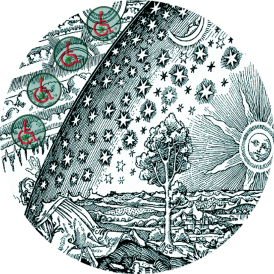



## SVG In Markup

> **Hint**. {{ page.hint }}

More to come ...

```liquid

{:height="500px" width="500px"}

```

Here, we are using an original `( .xcf )` file that has been exported from **GIMP** as a `( .psd )` of dimensions 725px x 725px x 96dpi and then imported via **Adobe Illustrator**, or **AI**.

Once inside **AI**, the `( .psd )` file is then "save as" an `( .svg )`.

Out comes an `( .svg )` file of dimensions 543.75px x 543.75px.

Now, an **SVG** file is both expandable and responsive.

To render a smaller version of the `( .svg )`, simply append an appropriate height and width, as follows:

```liquid

{:height="120px" width="120px"}

```

#### Live Image: SVG In Markup

The following **Live** rendition of the **MMI™ Flammarion Logo Badge** `( .svg )` image file is set to the dimensions of 500.00px x 500.00px.

{:height="500px" width="500px"}

## Last Subtitle

More to come ...

***

**Note**. The above synopsis was derived from an article written by Blank Author [[1](#BLANKAUTHOR){:.red}].

1. {:#BLANKAUTHOR}[A Narrative of Psychology by Blank Author, Jan #1999](http://cowles.yale.edu/sites/default/files/files/pub/d20/d2069.pdf){:title="Click to Review ..."}{:target="_blank"}

***


